#  IT Asset Management System

##  Project Summary
The "IT Asset Management System" is a robust full-stack web application developed for the Whizlabs Final Round Assessment. It serves as a digital registry designed to streamline the entire lifecycle management of IT assets within an organization, from initial procurement to eventual retirement. The system empowers both administrators and employees with comprehensive tools for asset tracking, assignment, maintenance scheduling, depreciation calculation, and issue reporting, ultimately enhancing operational efficiency and providing critical insights into asset utilization.

##  Expanded Features
-   **User Authentication & Authorization:**Secure JWT-based authentication system with role-based access control, distinguishing between Admin and Employee roles.
-   **Comprehensive Asset Management:**  Full CRUD (Create, Read, Update, Delete) operations for IT assets, allowing for detailed record-keeping including asset type, status, purchase date, and more.
-   **Employee Management:**  Centralized management of employee profiles, enabling easy tracking of assigned assets and employee-specific information.
-   **Asset Assignment & History:**  Efficient assignment and reassignment of assets to employees, maintaining a clear historical log of all asset movements.
-   **Issue Reporting & Tracking:**  A dedicated module for employees to report issues with assets, facilitating quick identification, tracking, and resolution by administrators.
-   **Scheduled Maintenance:**  Functionality to schedule, log, and track maintenance activities for assets, ensuring their optimal performance and longevity.
-   **Automated Depreciation:**  Automatic calculation of asset depreciation based on predefined methods, providing accurate financial insights into asset value over time.
-   **Intuitive Dashboard:** A dynamic dashboard offering a high-level overview of key performance indicators, asset distribution, status summaries, and recent activities.
-   **Request Management:** A system for employees to submit asset requests, which can be reviewed, approved, or denied by administrators.

## Screenshots

Here are some screenshots of the application pages:

### Dashboard


### Assets


### Assignments


### Employees


### Issue Report


### Maintenance


### Depreciation


### Requests


##  System Design Summary
The IT Asset Management System follows a classic MERN (MongoDB, Express.js, React.js, Node.js) stack architecture, designed for scalability, maintainability, and a rich user experience.

**Architecture Flow:**
The system operates with a clear separation of concerns between the frontend and backend.
1.  **Frontend (React.js):** Users interact with the application through a dynamic and responsive interface built with React.js, styled using Tailwind CSS. User actions, such as logging in, managing assets, or reporting issues, trigger asynchronous API requests to the backend.
2.  **Backend (Node.js + Express.js):** These requests are routed to the Node.js server, where Express.js handles API endpoints. The backend is responsible for business logic, data validation, and secure user authentication using JWT (JSON Web Tokens) for role-based access control.
3.  **Database (MongoDB Atlas):** The Express.js application communicates with MongoDB Atlas, a cloud-hosted NoSQL database, through Mongoose ODM. This layer performs all necessary CRUD operations to persist and retrieve application data.
4.  **Data Flow:** Upon processing, the backend sends JSON responses back to the frontend. The React.js application then updates its UI components to reflect the latest data, providing a seamless user experience.

```mermaid
graph TB
    subgraph CLIENT["CLIENT LAYER"]
        Frontend["React.js Frontend Application<br/>• Component-based UI<br/>• React Router for navigation<br/>• Context API for state management<br/>• Axios for HTTP requests<br/>• Tailwind CSS for styling"]
    end
    
    subgraph APPLICATION["APPLICATION LAYER"]
        Backend["Node.js + Express.js Backend<br/>• RESTful API endpoints<br/>• JWT authentication middleware<br/>• Role-based authorization<br/>• Business logic controllers<br/>• Input validation & sanitization"]
    end
    
    subgraph DATA["DATA LAYER"]
        Database["MongoDB Atlas Database<br/>• Users Collection<br/>• Assets Collection<br/>• Maintenance Logs Collection<br/>• Requests Collection<br/>• Issues Collection<br/>• Depreciation Records Collection"]
    end
    
    CLIENT <-->|HTTP/HTTPS| APPLICATION
    APPLICATION <-->|Mongoose ODM| DATA
    
    style CLIENT fill:#e1f5ff
    style APPLICATION fill:#fff4e1
    style DATA fill:#e8f5e9
```


## 🛠️ Technology Stack
| Category      | Technology    | Description                                     |
| :------------ | :------------ | :---------------------------------------------- |
| **Frontend**  | React.js      | JavaScript library for building user interfaces |
|               | Tailwind CSS  | Utility-first CSS framework                     |
|               | Axios         | Promise-based HTTP client for API requests      |
|               | React Router  | Declarative routing for React applications      |
|               | Context API   | React's built-in state management               |
| **Backend**   | Node.js       | JavaScript runtime environment                  |
|               | Express.js    | Web application framework for Node.js           |
|               | Mongoose      | MongoDB object data modeling (ODM)              |
| **Database**  | MongoDB Atlas | Cloud-hosted NoSQL database                     |
| **Auth**      | JWT           | JSON Web Tokens for secure authentication       |

##  Folder Structure Overview
The project is organized into two main directories: `backend` and `frontend`, each containing its specific components and configurations.

```
IT_ASSET_MANAGEMENT/
├── backend/
│   ├── config/          # Database connection and other configurations
│   ├── controllers/     # Business logic for handling requests
│   ├── models/          # Mongoose schemas for database collections
│   ├── routes/          # API endpoints definitions
│   ├── .env             # Environment variables (e.g., DB URI, JWT Secret)
│   └── server.js        # Main backend application entry point
└── frontend/
    ├── src/
    │   ├── assets/      # Static assets like images
    │   ├── components/  # Reusable UI components
    │   ├── context/     # React Context for global state management
    │   ├── hooks/       # Custom React hooks for reusable logic
    │   ├── pages/       # Page-level components (views)
    │   ├── services/    # API service calls (Axios instances)
    │   ├── App.jsx      # Main React application component
    │   └── main.jsx     # Entry point for the React application
    ├── package.json     # Frontend dependencies and scripts
```

##  Database Schema Overview
The MongoDB database is structured with several collections to manage different aspects of IT assets.

### User Schema
Represents system users (Admins and Employees).
```javascript
{
  username: { type: String, required: true, unique: true },
  email: { type: String, required: true, unique: true },
  password: { type: String, required: true },
  role: { type: String, enum: ['Admin', 'Employee'], default: 'Employee' },
  createdAt: { type: Date, default: Date.now }
}
```

### Asset Schema
Details of each IT asset.
```javascript
{
  name: { type: String, required: true },
  category: { type: String, required: true },
  serialNumber: { type: String, required: true, unique: true },
  purchaseDate: { type: Date, required: true },
  warrantyEndDate: { type: Date },
  status: { type: String, enum: ['Available', 'Assigned', 'Under Maintenance', 'Retired'], default: 'Available' },
  currentValue: { type: Number },
  assignedTo: { type: mongoose.Schema.Types.ObjectId, ref: 'User' }, // Employee
  createdAt: { type: Date, default: Date.now }
}
```

### Assignment Schema
Records asset assignments to employees.
```javascript
{
  asset: { type: mongoose.Schema.Types.ObjectId, ref: 'Asset', required: true },
  employee: { type: mongoose.Schema.Types.ObjectId, ref: 'User', required: true },
  assignmentDate: { type: Date, default: Date.now },
  returnDate: { type: Date },
  status: { type: String, enum: ['Assigned', 'Returned'], default: 'Assigned' }
}
```

### IssueReport Schema
Details of reported issues for assets.
```javascript
{
  asset: { type: mongoose.Schema.Types.ObjectId, ref: 'Asset', required: true },
  reportedBy: { type: mongoose.Schema.Types.ObjectId, ref: 'User', required: true },
  description: { type: String, required: true },
  reportDate: { type: Date, default: Date.now },
  status: { type: String, enum: ['Open', 'In Progress', 'Resolved', 'Closed'], default: 'Open' },
  resolutionDetails: { type: String }
}
```

### Maintenance Schema
Logs maintenance activities for assets.
```javascript
{
  asset: { type: mongoose.Schema.Types.ObjectId, ref: 'Asset', required: true },
  maintenanceDate: { type: Date, required: true },
  description: { type: String, required: true },
  cost: { type: Number },
  performedBy: { type: String },
  nextMaintenanceDate: { type: Date }
}
```

### Depreciation Schema
Tracks depreciation records for assets.
```javascript
{
  asset: { type: mongoose.Schema.Types.ObjectId, ref: 'Asset', required: true },
  date: { type: Date, default: Date.now },
  depreciationAmount: { type: Number, required: true },
  currentBookValue: { type: Number, required: true }
}
```

### Request Schema
Manages asset requests from employees.
```javascript
{
  requestedBy: { type: mongoose.Schema.Types.ObjectId, ref: 'User', required: true },
  asset: { type: mongoose.Schema.Types.ObjectId, ref: 'Asset' }, // Optional, if requesting a new asset type
  requestType: { type: String, enum: ['New Asset', 'Replacement', 'Repair'], required: true },
  description: { type: String, required: true },
  requestDate: { type: Date, default: Date.now },
  status: { type: String, enum: ['Pending', 'Approved', 'Denied', 'Fulfilled'], default: 'Pending' }
}
```

##  Key Challenges Faced and Solutions
-   **Complex State Management in React:** Managing global state across various components (e.g., authentication status, asset lists) was challenging.
    -   **Solution:** Implemented React Context API with custom hooks (`AuthContext`, `AssetContext`, `EmployeeContext`) to provide a centralized and efficient way to manage and consume state.
-   **Role-Based Access Control:** Ensuring that different user roles (Admin/Employee) have appropriate access levels to features and data.
    -   **Solution:** Implemented JWT-based authentication on the backend with middleware to verify user roles for protected routes. Frontend logic conditionally renders UI elements based on the authenticated user's role.
-   **Real-time Data Updates:** Reflecting changes in the database (e.g., asset status after assignment) across the application without manual refreshes.
    -   **Solution:** Utilized `useEffect` hooks with dependencies to re-fetch data when relevant state changes, ensuring the UI is always synchronized with the backend.
-   **Data Validation & Error Handling:** Ensuring data integrity and providing meaningful feedback to users on input errors.
    -   **Solution:** Implemented comprehensive server-side validation using Mongoose schema validators and Express-validator. Frontend forms include client-side validation and display error messages.

## Lessons Learned
-   **Importance of Modular Design:** Breaking down the application into smaller, reusable components (frontend) and distinct modules (backend controllers, models, routes) significantly improved maintainability and scalability.
-   **Effective API Design:** Designing RESTful APIs with clear endpoints and consistent response structures is crucial for seamless frontend-backend communication.
-   **Database Indexing:** Understanding and applying appropriate database indexing in MongoDB to optimize query performance, especially for frequently accessed fields.
-   **Security Best Practices:** Implementing secure authentication (JWT), hashing passwords, and sanitizing inputs are paramount for protecting user data and preventing vulnerabilities.
-   **Version Control (Git):** Consistent use of Git for version control, branching, and merging was essential for collaborative development and tracking changes.

## Future Enhancements
-   **Advanced Reporting & Analytics:** Integrate more sophisticated charting libraries and reporting tools to provide deeper insights into asset performance, costs, and utilization trends.
-   **Email Notifications:** Implement email notifications for critical events such as asset assignment, maintenance reminders, or issue status changes.
-   **Barcode/QR Code Scanning:** Add functionality to scan barcodes or QR codes for quick asset identification and management.
-   **User Activity Logs:** Implement a system to log all user actions for auditing and compliance purposes.
-   **Multi-tenancy Support:** Extend the system to support multiple organizations or departments with isolated data.
-   **Integration with IT Ticketing Systems:** Seamless integration with existing IT service management (ITSM) or ticketing systems.

## Demo Section
A 2-5 minute video demonstration showcasing the key features and workflows of the IT Asset Management System will be linked here.

[Link to Demo Video (Coming Soon!)]
